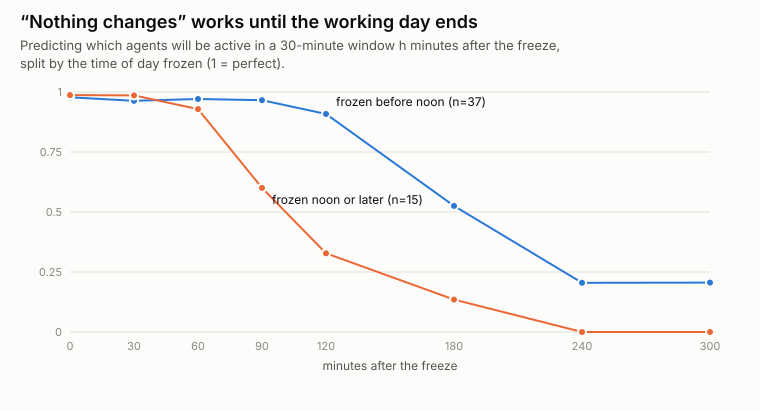

# Supplement: "nothing changes" works until the working day ends

*Context for finding 3 of the write-up. Script: `scripts/horizon.py`; no
model calls.*

## The question

No analyst beat "assume nothing changes" at forecasting. How good is that
rule at different distances into the future, and what makes it fail?

## What we did

For all 52 frozen moments we made the "nothing changes" prediction: the
agents active in the 30 minutes before the freeze will be the agents active
in a 30-minute window starting *h* minutes later. We then scored that
prediction against what actually happened, for *h* from 0 to 5 hours,
using the same partial-credit scoring as the main test.

| Minutes ahead | All 52 moments | Frozen before noon (37) | Frozen noon or later (15) |
|---|---|---|---|
| 0 | 0.98 | 0.98 | 0.99 |
| 60 | 0.96 | 0.97 | 0.93 |
| 90 | 0.86 | 0.97 | 0.60 |
| 120 | 0.74 | 0.91 | 0.33 |
| 180 | 0.41 | 0.53 | 0.13 |
| 240 | 0.15 | 0.21 | 0.00 |

## What we found

- **Agents' activity is extremely sticky within a working day.** Whoever is
  working now is almost exactly who will be working an hour from now.
- **The rule fails when the working day ends,** not because agents change
  what they do. Moments frozen in the afternoon lose accuracy after about
  an hour; morning moments hold up for about two. The village runs on a fixed daily schedule that got longer as the
project went on. The median daily active span was 2–3 hours through
October 2025, 4 hours from November 2025 to June 2026, and 8 hours from
July 2026. Around the freezes we sampled,
  the day's last activity came a median of about 3 hours after morning
  freezes and about 1.5 hours after afternoon freezes.
- **"Everyone on the roster is active" scores identically** at every
  horizon. Freezes are mid-workday, when nearly everyone is active, so the
  two predictions coincide.

## What it means

- **At these horizons, much of "what happens next" is a scheduling
  question.** None of our analysts was told the village's schedule. A
  dashboard that simply showed "the working day ends at 5pm" would likely
  help with "who will be working in 2 hours?" more than any analytic
  cleverness. That's an easy, untested improvement, left for follow-up.
- **A design caveat for our own test:** to avoid trick questions, we only
  froze moments where the village was still active 1–2 hours later. That
  makes "people keep working" even more likely to be right for the
  90–120-minute question, which flatters the "nothing changes" rule there.
- **For builders:** before claiming a tool forecasts swarm behaviour, plot
  this curve for your own system. It shows how hard "nothing changes" is
  to beat at each horizon, and what drives it.
