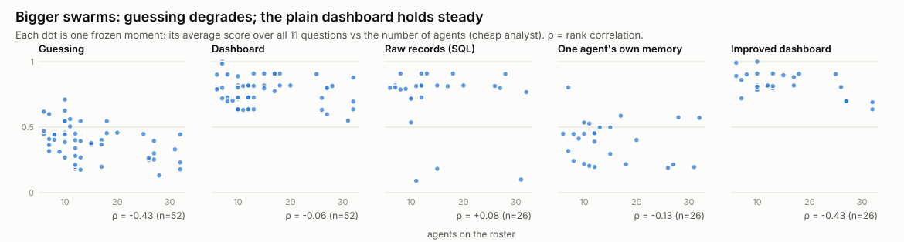

# Supplement: are bigger swarms harder to oversee?

*Script: `scripts/roster_size.py`; no model calls; cheap analyst
(DeepSeek V4 Flash) runs from the main study.*

## The question

The village grew from 6 to 32 agents over the year we sampled. Does a
bigger swarm make each view less useful?

## What we did

For every frozen moment, we took the analyst's average score over all 11
questions and plotted it against the number of agents. We used a rank
correlation (ρ, between −1 and +1; negative means bigger swarms score
lower) for each view.

| View | Moments | ρ overall | ρ "what's going on" | ρ "what it means" | ρ "what happens next" |
|---|---|---|---|---|---|
| Guessing | 52 | −0.43 | −0.33 | −0.20 | −0.24 |
| Dashboard | 52 | −0.06 | 0.00 | −0.26 | +0.14 |
| Raw records (SQL) | 26 | +0.08 | −0.12 | −0.13 | +0.21 |
| One agent's own memory | 26 | −0.13 | +0.06 | −0.10 | −0.16 |
| Improved dashboard | 26 | −0.43 | 0.00 | −0.41 | −0.21 |

## What we found

- **Guessing gets clearly worse as the swarm grows,** as you'd expect: more
  agents, more ways to be wrong.
- **The plain dashboard holds steady overall,** because it does the
  counting. "What's going on" stays perfect at every size.
- **Comprehension gets harder with size even with good views.** For the
  improved dashboard it declines noticeably (ρ = −0.41). In a big swarm,
  working out who talks to whom or who has gone quiet means sifting through
  much more.

## Caveats

- With 26–52 moments, a correlation like −0.4 has a wide margin of error
  (roughly ±0.3–0.4). Treat these as tendencies, not measurements.
- **Swarm size is tangled up with time.** Bigger swarms are the later
  months, which had different goals, longer working days and newer models.
  We can't separate "more agents" from "later era".

## What it means

If an oversight tool only works at small scale, a SAGAT test spread across
sizes will show it. It's worth checking specifically on the questions that
need *integrating* information (comprehension), where larger swarms seem to
bite first.
