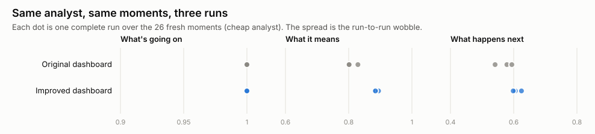

# Supplement: what if you just run the same analyst again?

*Script: `scripts/variance.py`. Cost: $1.55 for two extra runs.*

## The question

Each analyst in the main study answered each frozen moment once. AI models
don't give identical answers every time, so some of the differences we
report could just be run-to-run wobble. How big is it, and do our
conclusions survive it?

## What we did

We re-ran the cheap analyst (DeepSeek V4 Flash) on the original and
improved dashboards, over the same 26 fresh moments, twice more. That gave
three complete runs of each view, the original plus two repeats.

| View | Run | What's going on | What it means | What happens next | All |
|---|---|---|---|---|---|
| Original dashboard | 1 | 1.00 | 0.80 | 0.58 | 0.79 |
| | 2 | 1.00 | 0.83 | 0.59 | 0.80 |
| | 3 | 1.00 | 0.80 | 0.54 | 0.78 |
| Improved dashboard | 1 | 1.00 | 0.88 | 0.62 | 0.83 |
| | 2 | 1.00 | 0.89 | 0.61 | 0.82 |
| | 3 | 1.00 | 0.88 | 0.60 | 0.82 |

## What we found

- **The wobble is small.** Level averages moved by at most 0.05 between
  runs, and individual answers were identical on all three runs 87%
  (original dashboard) and 92% (improved dashboard) of the time.
- **The main improvement replicates.** The improved dashboard beat the
  original on "what it means" in all three runs (+0.07 to +0.08). On each
  run it was better at 7 moments and worse at only 1–2.
- **The small forecasting differences don't.** Improved minus original on
  "what happens next" was +0.05, +0.01 and +0.06 across the runs, each well
  within its margin of error. That's consistent with the write-up's
  conclusion that neither dashboard version beats "nothing changes" at
  forecasting.
- **The better-laid-out view is also more consistent** (92% vs 87% identical
  answers). When the answer is on the screen, the analyst finds it every
  time; when it has to infer, it varies.

## What it means

- For this analyst and these views, the noise between runs is smaller than
  the uncertainty from only having 26 moments. **More moments is a better
  use of budget than more repeats.**
- Differences of 0.05 or less between single runs should not be
  interpreted. Differences of about 0.08, replicated across runs and
  paired by moment, can be.
